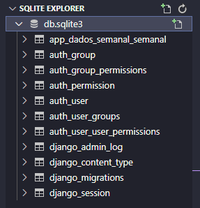
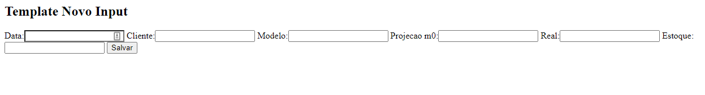

## PROJETO UTILIZANDO DJANGO

Feito : Victor Gonçalves  
Data : 02/02/2023

-----  
No Terminal (Shell)
```bash
django-admin # Traz todos os comando disponiveis
django-admin startproject 'nome projeto' # começar um projeto
cd 'no projeto'
ls - para verificar se realmente criou
python manage.py runserver      # criar um servidor local utilizando a porta 8000
python manage.py runserver 5000 # utilizando a porta 5000

```
### Arquivos Projeto

> manage.py  
Não mexer. Parametros standard para rodar a aplicação.

> db.sqlite3  
Banco de dados padrão.

> _pycache_  
Não mexer. Arquivos temporarios. 

> __init__  
Parametros iniciais de modularização.

> asgi.py e wsgi.py  
Modulos que permitem deixar a aplicação online.

> settings.py  
Configurações especificas.

### Projeto vs APP

Um projeto pode conter um ou mais aplicativos.  
Exemplo, projeto de Investimentos posso ter apps de investimento em Renda Fixa e Renda Variavel.

```bash
python manage.py startapp 'nome_app'
```

Dentro do *settings.py (PROJ) > INSTALLED_APPS*, devemos adicionar o app criado.  

### ROTAS  
Ciclo de app WEB: 
1. Navegação ate a pagina; 
2. Django busca o mapeamento da pagina em *urls.py*;
3. Direciona a função que cria a pagina *views.py*;
4. Retorna os dados/funções ao front end;

Para criar as rotas (URLS) devemos acessar o *urls.py(PROJ)*.  
Por padrão somente temos o /admin.

*urls.py* aqui é possivel definir as rotas de acordo com a função criada em views.py  

```python
from dados_semanal import views  
#views retornar alguma resposta dado o link direcionado abaixo.

urlpatterns = [
    path('admin/', admin.site.urls),
    path('', views.pagina_inicial),
    path('contato/', views.contato),
]

```
>
*views.py* Aqui é possivel montar a visualização de cada pagina.
**instance** sempre que utilizar esse parametro na função ele instancia algo ja EXISTENTE. 


Exemplo de função para retornar o valor inputado.
```python
def input_realizado (request):
    tipo_input = {
        'tipo_input': request.POST.get('TipoInput')
    }
    return render(request,'templates/input_registrado.html',tipo_input)
```

### TEMPLATES  
É necessario jogar a pasta de Templates dentro do APP.
Com isso, modificar o settings TEMPLATES.

### MODELS  (dentro do app_)
É super importante para persistir os dados. Ou seja, guardar em algum local.
Como submeter dados em um banco de dados ?

Documentação: https://docs.djangoproject.com/en/3.1/topics/db/models/


SQLite - Não precisa instalar servidor, pois já é nativo Python.  

**MIGRATION** - Não é necessario escrever linha de codigo em SQL.  
Criação automatica das tabelas conforme o Models.

```bash 
python manage.py makemigrations
> app_dados_semanal/migrations/0001_initial.py #nome do migration 00001_initial.py
> - Create model Semanal

python manage.py migrate    #aplicando para o banco de dados.

#Caso queria saber a query em SQL
python manage.py sqlmigrate app_dados_semanal 0001_initial

```



Caso, queira *adicionar ou remover uma coluna de uma tabela*, basta modificar em models e rodar o *python manage.py makemigrations* > *python manage.py migrate*.

### CRUD

Django Admin - Painel de gerenciamento, necessario incluir o path dentro do *urls.py*.

```bash
python manage.py createsuperuser
Usuário (leave blank to use 'gitpod'): goncavic01     
Endereço de email: victor1cg@hotmail.com
Password: elux1234
Password (again): elux1234
```

Dentro do arquivo *admin.py* iremos importar todas os templates que queremos visualizar.

```bash
from .models import Semanal
admin.site.register(Semanal)
```

Listando os inputs para o usuario visualizar na primeira pagina. 
Alterar em *urls.py* a home  
E alterar o *views.py*:

```python
from .models import Semanal

def input_registrado(request):
    dados = {
        'dados': Semanal.objects.all()            #ir até a tabela Semanal, e traga todos os registros.
    }
    return render (request,'input_registrado.html', context = dados)
```

#### **HASHTAG CANDIOTO** :

```python
#dentro de models.py podemos adicionar uma segunda tabela com relação na chave na primeira tabela:
class Question():
    question_text = models.CharField(max_lenght =100)
    pub_date = models.DateTime('date published') #data published é o alias do campo;
    
    #função ao realizar Question.objects.all() irá retornar a descrição da pergunta.
    def __str__(self):
        return self.question_text()
    
    #função que verifica se o pub date é de hoje, ou de ontem;
    #timedelta é uma função para adicionar dias em alguma data;
    def was_published_recently(self):
        return self.pub_date >= timezone.now()-datetime.timedelta(days=1)

class Choice (models.Model):
    # nessa linha existe uma relação que necessariamente precisa existir uma question para ter uma choice.
    question = models.ForeignKey(Question, on_delete = models.cascade)
    choice_text = models.CharField()
    votes = models.IntegerField(default=0)


## Dentro da views.py

#relembrando --> try -  executa o codigo | except: se der erro | else : se der certo | finally : sempre roda.

def vote (request,question_id):
    question = get_object_or_404(Question, pk = question_id)        #Question é a class
    try:
        selected_choice = question.choice_set.get(pk=request.POST['choice'])    #caso aquele question_id seja valido, iremos realizar o POST no vote
    except KeyError:
        return render(request, 'pools/vote.html', {'question':question},error_message : "You didn't selected a choice")

    else:
        selected_choice.votes += 1
        selected_choice.save()
        return HttpResponseRedirect(reverse('pools:result'), args=(question.id)))   #reverse é para retornar a pagina resultado
    
```


**No shell** é possivel realizar algumas consultas:

```bash
python manage.py shell
---------
from app_dados_semanal.models import Semanal

Semanal.objects.all()
Out[]: <QuerySet [<Semanal: Semanal object (1)>, <Semanal: Semanal object (2)>, <Semanal: Semanal object (3)>]>
#ou seja, temos 3 registros aqui no DB. Pois, instaciamos o Object Semanal.

#CRIANDO UM NOVO REGISTRO
q = Semanal(data = '2023-01-02',cliente = 'FAST SHOP',modelo = 'LAC12',estoque = 100)
print(q)
q.save()

#consultar os atributos
q.id
Out[]: 4
q.modelo
Out[]: 'LAC12'

# choice_set is a  automatically generating a field on each instance called choice_set where Choice is s the model with a ForeignKey field.

q.choice_set.create(choice_text = 'Curti', votes =10)
q.choice_set.create(choice_text = 'Não Curti', votes =3)

q.choice_set.all()

```
----------------------
### VISUALIZAR NO DETALHE DE CADA TRANSAÇÃO  
Criar uma nova função em view para direcionar pelo id da transação.

### CRIANDO NOVOS INPUTS
Dentro do template que esta como pagina inicial, inserir um botão para adicionar um novo input de dados.

>FORMS  
Dentro do APP criar o arquivo *forms.py*. 


Esse é a nova pagina para input de valores.
Com o _ _ all _ _ é possivel trazer todos os campos.



### FEATURE EXCLUIR

Boa pratica é receber uma mensagem de confirmação.
